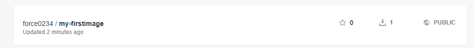
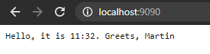
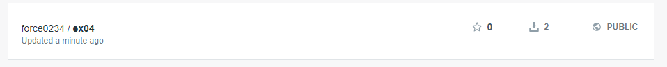

# Exercise 04 - Schneglberger Martin - S1810455022

## Part 1

After checking the commands again we learned in the lecture, I created the following `Dockerfile`:

```
FROM golang:1.11-alpine

# Set maintainer label: maintainer=[YOUR-EMAIL]
LABEL maintainer='schneglb@gmail.com'

# Set working directory: `/src`
WORKDIR /src

# Copy local file `main.go` to the working directory
COPY main.go WORKDIR
# or using RUN and cp

# List items in the working directory (ls)
RUN ls

# Build the GO app as myapp binary and move it to /usr/
RUN go build -o /usr/myapp

#Expose port 8888
EXPOSE 8080

# Run the service myapp when a container of this image is launched
ENTRYPOINT ["/usr/myapp"]
```

But this is actually wrong, as `WORKDIR` cannot be used like an evironment variable => Error: *can't load package: package .: no Go files in /src*   
Thus the right configuration looks like this (the working directory can be accessed via an `.`)

```
FROM golang:1.11-alpine

# Set maintainer label: maintainer=[YOUR-EMAIL]
LABEL maintainer='schneglb@gmail.com'

# Set working directory: `/src`
WORKDIR /src

# Copy local file `main.go` to the working directory
COPY main.go .

# List items in the working directory (ls)
RUN ls

# Build the GO app as myapp binary and move it to /usr/
RUN go build -o /usr/myapp

#Expose port 8888
EXPOSE 8080

# Run the service myapp when a container of this image is launched
ENTRYPOINT ["/usr/myapp"]
```

New output:

```
Sending build context to Docker daemon  67.58kB
Step 1/8 : FROM golang:1.11-alpine
 ---> e116d2efa2ab
Step 2/8 : LABEL maintainer='schneglb@gmail.com'
 ---> Using cache
 ---> 6a11b2d0e377
Step 3/8 : WORKDIR /src
 ---> Using cache
 ---> 60579008d3f5
Step 4/8 : COPY main.go .
 ---> Using cache
 ---> f31cb728d146
Step 5/8 : RUN ls
 ---> Using cache
 ---> e93d7cb9c8a1
Step 6/8 : RUN go build -o /usr/myapp
 ---> Using cache
 ---> a2e463322b6a
Step 7/8 : EXPOSE 8080
 ---> Using cache
 ---> 7fb319c5cd03
Step 8/8 : ENTRYPOINT ["/usr/myapp"]
 ---> Using cache
 ---> 950540671f38
Successfully built 950540671f38
Successfully tagged force0234/my-firstimage:0.0.1
```

Output `docker images`:

```
...
force0234/my-firstimage     0.0.1               950540671f38        6 minutes ago       318MB
...
```



## Part 2

`docker container run -d --name my_hello -p 9090:8888 force0234/myhello:0.0.1`   
=> --name to give the container a name and allow accessing it by that one in the CLI    
=> -d to run the container in detached mode in the CLI

Output: 

```
CONTAINER ID        IMAGE                     COMMAND             CREATED             STATUS              PORTS                              NAMES
c930af3384a6        force0234/myhello:0.0.1   "/usr/myapp"        3 seconds ago       Up 2 seconds        8080/tcp, 0.0.0.0:9090->8888/tcp   my_hello
```



Stop:

`docker stop c930af3384a6` or `docker stop my_hello`

## Part 3

`.travis.yml` - First iteration:

```
language: go

go:
  - 1.14.x

services: 
  - docker

script:
  - go test -v
  - go build -o ex04
  - echo "$REGISTRY_PASSWORD" | docker login --username $REGISTRY_USER --password-stdin
  - docker build -f Dockerfile -t force0234/ex04:latest ./
  - GIT_SHA="$(git rev-parse --short HEAD"
  - docker tag force0234/ex04:latest force0234/ex04:$GIT_SHA
```

Errors:

```
The command "GIT_SHA="$(git rev-parse --short HEAD"" exited with 1.
0.06s$ docker tag [secure]/ex04:latest [secure]/ex04:$GIT_SHA
Error parsing reference: "[secure]/ex04:" is not a valid repository/tag: invalid reference format
The command "docker tag [secure]/ex04:latest [secure]/ex04:$GIT_SHA" exited with 1.
```

Mistake: missed closing bracket.  


After fixing it, the build succeeded, but I could not find the artifact in Docker Hub as...I forgt to push it...arghhhh:  

Adding this to the `.travis.yml`:
```
  - docker push force0234/ex04:latest
  - docker push force0234/ex04:$GIT_SHA
```

Results in this (finally):  



Tags:  


Pulling it: 

`docker image pull force0234/ex04:latest`  

`docker images` => Output:  

```
REPOSITORY                  TAG                 IMAGE ID            CREATED             SIZE
force0234/ex04              latest              17b361699784        5 minutes ago       318MB
```
